<!-- ═══════════════════════════════════════════════════════════════════ -->
<!-- HEADER: Typing animation bilingüe + wave banner                   -->
<!-- ═══════════════════════════════════════════════════════════════════ -->

  <!-- Typing SVG animado con rotación de roles clave -->
  

    

  <!-- Badges informativos de estado -->
  
  
  

   

  <!-- Selector de idioma -->
  **🌐 Language / Idioma:** [English](#-about-me) · [Español](#-sobre-mí)

 

<!-- ╔═══════════════════════════════════════════════════════════════════╗ -->
<!-- ║                    🇬🇧 ENGLISH VERSION                           ║ -->
<!-- ╚═══════════════════════════════════════════════════════════════════╝ -->

## 🧑‍💻 About Me

> *Software Engineer focused on robust backend architecture, AI/ML integration, data orchestration, and intelligent automation.*

I build **scalable, production-ready systems** using Python. My experience spans from designing complex backend architectures and implementing AI-powered solutions to leading data migration pipelines and automating enterprise workflows. I write clean, well-documented, and maintainable code — because production code is read far more often than it's written.

<table>
  <tr>
    <td width="50%">

### 🎯 Current Focus
- 🏗️ Designing **scalable backend architectures** with Django & FastAPI
- 🤖 Building solutions with **GenAI, MCP Servers & LangChain**
- 🔄 Automating enterprise workflows with **n8n & Python scripts**
- 🗄️ Leading **complex data migrations** & ETL pipelines
- 📊 Data analysis & prototyping with **Pandas & Jupyter**

</td>
<td width="50%">

### 💡 Engineering Principles
- 📐 **Clean Code & SOLID** — not just practices, a philosophy
- � **Test-driven** mindset with automated coverage
- 🔁 **CI/CD** and reproducible deployments
- 📖 **Well-documented** APIs and systems
- 🚀 Focus on **solutions that scale** in production

</td>
  </tr>
</table>

 

<!-- ═══════════════════════════════════════════════════════════════════ -->
<!-- KEY EXPERIENCE: Measurable impact to catch recruiter attention     -->
<!-- ═══════════════════════════════════════════════════════════════════ -->

## 🏆 Key Experience

<table>
  <tr>
    <td align="center" width="25%">
      
       <b>Backend Engineering</b>
       Building microservices and REST APIs with Python, Django, and FastAPI. Designing scalable architectures with clean, maintainable code and comprehensive test coverage.
    </td>
    <td align="center" width="25%">
      
       <b>AI/ML & GenAI</b>
       Integrating AI into real-world workflows using MCP servers, prompt engineering, and automation tools. Exposing ML/GenAI capabilities as production-ready services.
    </td>
    <td align="center" width="25%">
      
       <b>Data Engineering</b>
       Designing and executing complex ETL pipelines for data migration between legacy systems and modern ERPs. Advanced SQL, data validation, and transformation at scale.
    </td>
    <td align="center" width="25%">
      
       <b>Automation</b>
       Building automation scripts, web scraping solutions, and workflow orchestration with n8n. Turning repetitive manual processes into reliable automated pipelines.
    </td>
  </tr>
</table>

 

<!-- ═══════════════════════════════════════════════════════════════════ -->
<!-- TECH STACK: Organized by domain with modern badges                 -->
<!-- ═══════════════════════════════════════════════════════════════════ -->

## 🛠️ Tech Stack

<!-- Backend principal -->

<b>⚙️ Backend & Frameworks</b>

 

<!-- AI/ML & GenAI -->

<b>🤖 AI/ML & GenAI</b>

 

<!-- Data & Automation -->

<b>📊 Data & Automation</b>

 

<!-- DevOps & Cloud -->

<b>☁️ DevOps & Cloud</b>

 

<!-- Frontend (secundario) -->

<b>🨠Frontend</b>

 

 

---

<!-- ╔═══════════════════════════════════════════════════════════════════╗ -->
<!-- ║                    🇪🇸 VERSIÓN EN ESPAÑOL                        ║ -->
<!-- ╚═══════════════════════════════════════════════════════════════════╝ -->

## 🧑‍💻 Sobre mí

> *Ingeniero de Software especializado en arquitectura backend robusta, integración de IA/ML, orquestación de datos y automatización inteligente.*

Construyo **sistemas escalables y listos para producción** usando Python. Mi experiencia va desde diseñar arquitecturas backend complejas e implementar soluciones con IA, hasta liderar pipelines de migración de datos y automatizar flujos empresariales. Escribo código limpio, bien documentado y mantenible — porque el código de producción se lee mucho más de lo que se escribe.

<table>
  <tr>
    <td width="50%">

### 🎯 Enfoque actual
- 🏗️ Diseñando **arquitecturas backend escalables** con Django y FastAPI
- 🤖 Construyendo soluciones con **GenAI, servidores MCP y LangChain**
- 🔄 Automatizando flujos empresariales con **n8n y scripts Python**
- 🗄️ Liderando **migraciones de datos complejas** y pipelines ETL
- 📊 Análisis de datos y prototipado con **Pandas y Jupyter**

</td>
<td width="50%">

### 💡 Principios de ingeniería
- 📐 **Clean Code y SOLID** — no solo prácticas, una filosofía
- 🧪 Mentalidad **orientada a testing** con cobertura automatizada
- 🔁 **CI/CD** y despliegues reproducibles
- 📖 APIs y sistemas **bien documentados**
- 🚀 Enfoque en **soluciones que escalan** en producción

</td>
  </tr>
</table>

 

## 🏆 Experiencia clave

<table>
  <tr>
    <td align="center" width="25%">
      
       <b>Ingeniería Backend</b>
       Construcción de microservicios y APIs REST con Python, Django y FastAPI. Diseño de arquitecturas escalables con código limpio, mantenible y cobertura de tests.
    </td>
    <td align="center" width="25%">
      
       <b>IA/ML y GenAI</b>
       Integración de IA en flujos de trabajo reales usando servidores MCP, prompt engineering y herramientas de automatización. Exposición de capacidades ML/GenAI como servicios productivos.
    </td>
    <td align="center" width="25%">
      
       <b>Ingeniería de Datos</b>
       Diseño y ejecución de pipelines ETL complejos para migración de datos entre sistemas legacy y ERPs modernos. SQL avanzado, validación y transformación a escala.
    </td>
    <td align="center" width="25%">
      
       <b>Automatización</b>
       Desarrollo de scripts de automatización, soluciones de web scraping y orquestación de flujos con n8n. Transformando procesos manuales repetitivos en pipelines automatizados confiables.
    </td>
  </tr>
</table>

 

---

<!-- ═══════════════════════════════════════════════════════════════════ -->
<!-- ESTADÍSTICAS DE GITHUB: Métricas visuales de actividad            -->
<!-- ═══════════════════════════════════════════════════════════════════ -->

## 📊 GitHub Stats

  <!-- Stats card y Top Languages lado a lado -->
  
  

   

  <!-- Streak Stats -->
  

 

<!-- ═══════════════════════════════════════════════════════════════════ -->
<!-- MÉTRICAS AVANZADAS: Generadas por el workflow de GitHub Actions    -->
<!-- ═══════════════════════════════════════════════════════════════════ -->

## 📈 Detailed Metrics / Métricas detalladas

  

 

<!-- ═══════════════════════════════════════════════════════════════════ -->
<!-- SNAKE ANIMATION: Contribuciones visualizadas                      -->
<!-- ═══════════════════════════════════════════════════════════════════ -->

## 🐍 Contributions / Contribuciones

  <picture>
    <source media="(prefers-color-scheme: dark)" srcset="https://raw.githubusercontent.com/artur282/artur282/output/github-snake-dark.svg" />
    <source media="(prefers-color-scheme: light)" srcset="https://raw.githubusercontent.com/artur282/artur282/output/github-snake.svg" />
    
  </picture>

 

<!-- ═══════════════════════════════════════════════════════════════════ -->
<!-- CONTACTO: CTAs claros para reclutadores en ambos idiomas          -->
<!-- ═══════════════════════════════════════════════════════════════════ -->

## 📬 Let's Connect / ¿Hablamos?

  *Open to new professional opportunities and interesting collaborations.*
   
  *Abierto a nuevas oportunidades profesionales y colaboraciones interesantes.*

    

  
  
  

<!-- ═══════════════════════════════════════════════════════════════════ -->
<!-- FOOTER: Wave animation para cerrar el perfil                      -->
<!-- ═══════════════════════════════════════════════════════════════════ -->

